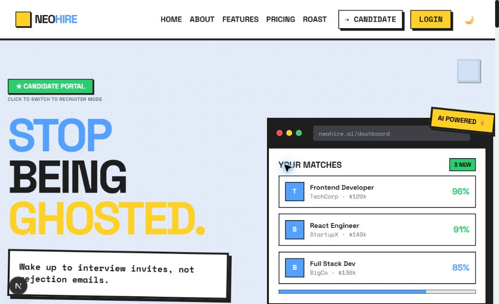
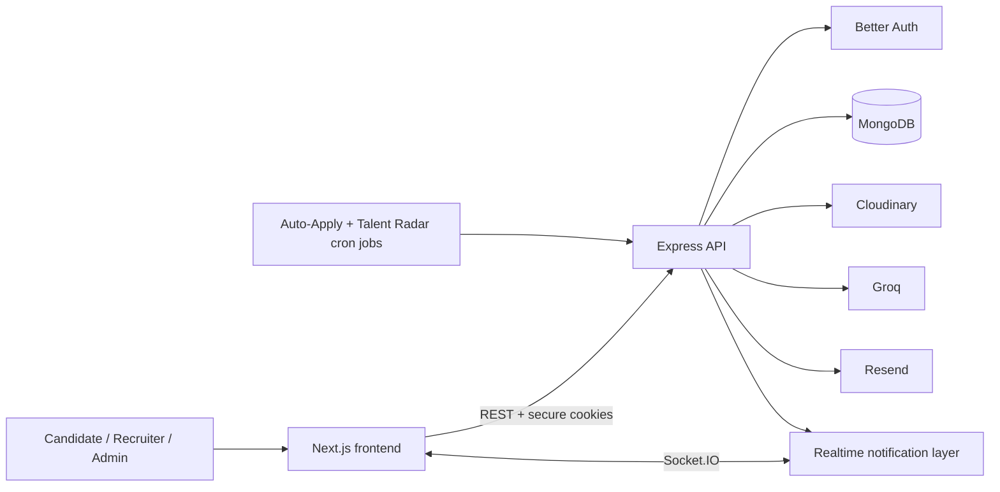

<div align="center">

# NeoHire

### AI-powered hiring for candidates, recruiters, and modern teams

Find better-fit jobs, rank applicants intelligently, automate applications, and discover hidden talent from one platform.

[Live Product](https://www.neohire.site) · [Candidate Demo](https://www.neohire.site/login?mode=candidate) · [Recruiter Demo](https://www.neohire.site/login?mode=recruiter)

[GitHub source - v2 branch](https://github.com/Raj3019/NeoHire/tree/v2)

</div>



## What is NeoHire?

NeoHire is a full-stack hiring platform that brings candidates, recruiters, and administrators into a single workflow. It combines structured profiles, job discovery, AI-assisted matching, application tracking, automated applications, recruiter talent alerts, real-time notifications, and platform administration.

The product has three focused experiences:

| Experience | What it provides |
| --- | --- |
| Candidate | Profile and resume management, job recommendations, applications, AI match scores, auto-apply, Resume Roast, and notifications |
| Recruiter | Job publishing, candidate discovery, ranked applicants, application pipelines, hiring analytics, and Talent Radar alerts |
| Admin | Platform metrics, user moderation, job moderation, account status management, and activity auditing |

## Highlights

- **AI match scoring** evaluates skills, experience, and education for each application.
- **Auto-Apply** submits candidates to highly relevant jobs based on a configurable match threshold.
- **Talent Radar** alerts recruiters when opted-in candidates match their hiring criteria.
- **Resume Roast** provides AI-generated resume feedback using Groq.
- **Real-time notifications** use Socket.IO while retaining notifications in MongoDB.
- **Role-based authentication** supports email/password, verification, Google OAuth, and secure cookie sessions through Better Auth.
- **Usage controls** enforce configurable monthly and request-level limits.
- **Admin observability** provides activity logs, trends, user metrics, and job moderation.
- **Production demo seed** creates safe, repeatable sample accounts and connected data without deleting existing records.

## Technology

| Layer | Technologies |
| --- | --- |
| Frontend | Next.js 16, React 19, Tailwind CSS 4, Zustand, Axios, Framer Motion, Recharts, TipTap |
| Backend | Node.js, Express 5, Mongoose, Better Auth, Socket.IO, Zod |
| Data | MongoDB Atlas |
| AI | Groq SDK |
| Files and email | Cloudinary, Multer, Resend |
| Automation | node-cron |

## Architecture



The frontend runs on port `3001` during development and proxies `/api/*` requests to the backend on port `3000`.

## Repository structure

```text
NeoHire/
├── Backend/
│   ├── controller/      # Request handlers and business workflows
│   ├── middleware/      # Auth, roles, limits, uploads, and auditing
│   ├── model/           # Mongoose schemas
│   ├── routers/         # Express API routes
│   ├── services/        # Scheduled Auto-Apply and Talent Radar jobs
│   ├── scripts/         # Idempotent production demo seed
│   ├── utils/           # Matching, email, upload, and notification helpers
│   └── app.js            # Express and Socket.IO entry point
├── Frontend/
│   ├── public/          # Static brand assets
│   └── src/
│       ├── app/         # Next.js App Router pages
│       ├── components/  # Product and shared UI components
│       └── lib/         # API client and Zustand stores
└── docs/images/         # README and documentation images
```

## Local development

### Prerequisites

- Node.js 20 or newer
- npm
- MongoDB Atlas or a compatible MongoDB deployment
- Cloudinary account for profile pictures and resumes
- Resend account for verification and account emails
- Groq API key for AI features

### 1. Install dependencies

```bash
cd Backend
npm install

cd ../Frontend
npm install
```

### 2. Configure the backend

Copy `Backend/.env.example` to `Backend/.env` and configure the required services.

```env
PORT=3000
NODE_ENV=development
MONGODB_URL=mongodb+srv://...
FRONTEND_URL=http://localhost:3001

GOOGLE_CLIENT_ID=...
GOOGLE_CLIENT_SECRET=...

CLOUDINARY_CLOUD_NAME=...
CLOUDINARY_API_KEY=...
CLOUDINARY_API_SECRET=...

RESEND_API_KEY=...
EMAIL_FROM=...
GROQAPIKEY=...

AUTO_APPLY_CRON_JOB=...
TALENT_RADAR_CRON_JOB=...

MAX_JOBS_PER_RECRUITER=5
MAX_APPLICATIONS_PER_EMPLOYEE=5
MAX_RESUME_ROASTS_PER_USER=3
MAX_TALENT_RADAR_ALERTS_PER_RECRUITER=3
```

### 3. Configure the frontend

Copy `Frontend/.env.example` to `Frontend/.env.local`.

```env
NEXT_PUBLIC_API_URL=http://localhost:3000

NEXT_PUBLIC_DEMO_EMAIL_DOMAIN=demo.neohire.site
NEXT_PUBLIC_DEMO_CANDIDATE_PASSWORD=NeoHireDemo@2026
NEXT_PUBLIC_DEMO_RECRUITER_PASSWORD=NeoHireDemo@2026
```

When `NEXT_PUBLIC_API_URL` is omitted during local development, Next.js proxies requests to `http://localhost:3000/api`.

### 4. Start both applications

Backend terminal:

```bash
cd Backend
npm run dev
```

Frontend terminal:

```bash
cd Frontend
npm run dev
```

Open [http://localhost:3001](http://localhost:3001).

## Demo accounts

The login screen displays public candidate and recruiter demo credentials and provides a one-click autofill action.

| Portal | Email | Default password |
| --- | --- | --- |
| Candidate | `candidate@demo.neohire.site` | `NeoHireDemo@2026` |
| Recruiter | `recruiter@demo.neohire.site` | `NeoHireDemo@2026` |

Admin credentials are private and must never be exposed in frontend variables or documentation.

## Demo data seed

The production-safe seed creates real Better Auth accounts and connected profile, job, application, notification, Talent Radar, and activity data. It uses deterministic upserts and never clears collections.

Validate the dataset without connecting to MongoDB:

```bash
cd Backend
npm run seed:demo:validate
```

To run the seed once, configure:

```env
SEED_DEMO_DATA=true
ALLOW_PRODUCTION_DEMO_SEED=true
DEMO_ADMIN_PASSWORD=use-a-private-password-with-at-least-12-characters
```

Then execute:

```bash
npm run seed:demo
```

After a successful production seed, remove `SEED_DEMO_DATA` and `ALLOW_PRODUCTION_DEMO_SEED` from the runtime environment.

## Useful scripts

| Directory | Command | Purpose |
| --- | --- | --- |
| Backend | `npm run dev` | Start Express with Nodemon |
| Backend | `npm run seed:demo:validate` | Validate demo templates without a database connection |
| Backend | `npm run seed:demo` | Upsert the connected demo dataset |
| Frontend | `npm run dev` | Start Next.js on port 3001 |
| Frontend | `npm run build` | Create a production build |
| Frontend | `npm run start` | Run the production build |
| Frontend | `npm run lint` | Run ESLint |

## API overview

All application endpoints are mounted under `/api`.

| Prefix | Responsibility |
| --- | --- |
| `/api/auth` | Better Auth sessions, email/password, verification, and OAuth |
| `/api/employee` | Candidate profile, dashboard, applications, and recommendations |
| `/api/recruiter` | Recruiter profile, candidates, applications, and statistics |
| `/api/jobs` | Job creation, editing, discovery, and details |
| `/api/applications` | Applications and AI match scoring |
| `/api/auto-apply` | Candidate automation settings and history |
| `/api/talent-radar` | Recruiter alerts, matches, and candidate opt-in |
| `/api/notifications` | Persistent notification inbox |
| `/api/try` | Resume Roast |
| `/api/admin` | Platform administration |
| `/api/activity` | Auditing and activity statistics |
| `/api/usage-limits` | Current-user usage counters and limits |

## Security and operational notes

- Better Auth sessions use HTTP-only cookies.
- Candidate, recruiter, and administrator routes enforce role and account-status checks.
- Suspended and banned accounts are blocked during login and authenticated requests.
- Upload, application, job, authentication, and AI-heavy routes are rate limited.
- Production CORS origins must match the deployed frontend URL.
- Public demo accounts can modify their own demo data. Rerun the idempotent seed to restore the core demo state.
- Never commit `.env`, credentials, MongoDB URLs, or the private admin password.

## Deployment

Deploy the frontend and backend as separate services:

1. Configure backend environment variables and deploy the Express service.
2. Set `FRONTEND_URL` to the deployed frontend origin.
3. Configure the frontend with `NEXT_PUBLIC_API_URL` pointing to the backend origin.
4. Build and deploy the Next.js frontend.
5. Run the demo seed as a one-time backend command if public demo access is required.
6. Remove the production seed confirmation flags after the seed succeeds.

## Contributing

Contributions are welcome. Create a focused branch, keep frontend and backend changes scoped, run the relevant validation/build commands, and open a pull request describing the user-facing behavior and verification performed.

## License

This project is currently distributed under the ISC license declared by the backend package.
